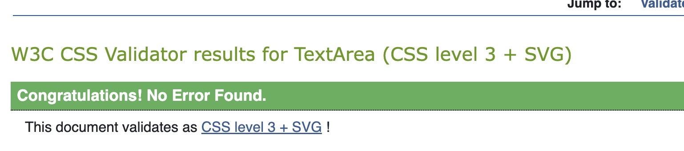

# Tic-Tac-Toe

[Tic-Tac-Toe](https://github.com/Aaronharding10/Tic-Tac-Toe1) is a website containing an interactive but easy and fun game of X's and O's with the player competing against the computer. 

## Table of contents

### [User experience](#user-experience)
The game uses minimalist design to ensure the game is easy to understand and play. The game is player against computer and there is a scoareboard to also track games won and lost. The player represents 'X' and always makes the first move. Meanwhile the computer is always 'O' and will always go second.

### [Design](#design)
* Typography - 
 The font styling throughout the website is mainly 'Georgia' and 'Sans Serif'. 

 * Game area - 
 The game area consists of a 3x3 grid with each players details such as score and symbol to their respective sides. 

 * Footer - 
 The footer at the bottom is the opposite color to the rest of the interface to draw the users attention to how the game is played. 

 * Wireframes - 
  *Mainly a pen and notebook were used to structure the site. 

### [Features](#features)

### Game Area
The Grid is the main area of the website and represents the grid consisting of 3x3 even squares in which the game will take place. It also contains a restart button which restarts each game, clears the board and updates the relevant score.
 

### Player area
This section to the left of the site highlights the players score and also their symbol 'X'.

### Computer area
This section to the right of the grid highlights the computer's score and it's symbol 'O'.

### Footer
The footer at the bottom of the site explains the game rules 

### Message Display
Once a game has finished a message appears just above the grid alerting the player of the result. Example within 

###

### Color

Colors were kept as black and white as possible as the game itself is very black and white and minimalist. "Whitesmoke" however was used for the background color throughout.

### [Features Left to Implement](#features-left-to-implement)
* Improved computer logic - 
I would like to implement some logic within the makeComputerMove function to improve it's ability to attack and defend instead of picking random cells to choose.  
*  I would also consider making it a best of series such as best of 5 or even 7 but the idea of an infinity game would appeal to a lot of people as it is quite relaxing and used mainly for fun. 

### [Frameworks, Libraries & Programs Used](#frameworks-libraries--programs-used-)

* [Gitpod](https://www.gitpod.io/)
      * To write the code.
 * [Github](https://github.com/)
      * Deployment of the website and storing the files online.
 * [Am I Responsive](https://ui.dev/amiresponsive)
   

### Javascript

The Javascript code for Tic-Tac-Toe contains comments explaining the reasoning behind the functions and functions used. The handleCellClick and makeComputerMove functions are essential to how the game is played. However the checkWinner function is the most essential as this loops through each possible winning combination, it then destrcutures each combination array into 'a','b' and'c'. If the values at 'a','b' and 'c' are all the same it determines a winner. If no winner is found in the loop but all cells on the board are full it will result in a tie. The function for processTurn is also very important with the flow of the game and the setTimeout function allows a delay just after the player move and before the computer makes it's move to add a more steady flow to the game. 

## TESTING

### Manual Testing

<table>  
            <tr>
              <th>Action</th>
              <th>Expected behaviour</th>
              <th>Pass/fail</th>
            </tr>
            <tr>
              <td>Clicking cell to populate players symbol</td>
              <td>Displays players 'X' symbol in cell</td>
              <td>Pass</td>
            </tr>
            <tr>
              <td>Generate computer move once player has gone</td>
              <td>A random cell on the board is populated with 'O'.</td>
              <td>Pass</td>
            </tr>
            <tr>
              <td>Testing Player win</td>
              <td>Once the player has won the 'Winner' display message appears</td>
              <td>Pass</td>
            </tr>
            <tr>
              <td>Testing player loss</td>
              <td>Once the computer has won a display message appears to try again</td>
              <td>Pass</td>
            </tr>
            <tr>
              <td>Testing a tie game</td>
              <td>Upon a tie and all cells are full with no winner, the game announces a tie and prompts to try again</td>
              <td>Pass</td>
            </tr>
            <tr>
              <td>Clicking restart button</td>
              <td>Once a game has been decided and is over the game does not restart until the restart button has been pressed</td>
              <td>Pass</td>
            </tr>
            <tr>
              <td>Clicking on full cells</td>
              <td>When clicking on a full cell nothing happens.</td>
              <td>Pass</td>
            </tr>
            <tr>
              <td>Updating score after each game</td>
              <td>After a winner or loser has been decidied the score area for the respective winner increases by 1</td>
              <td>Pass</td>
              </tr>
              <td>Clicking on cell after game end</td>
              <td>Once a game ends, clicking on a cell be it empty or full has no action</td>
              <td>Pass</td>
              </tr>      
</table>

### User Testing

The website was provided to 2 users who were both easily able to play and understand the game method. Both users highlighted the computer's random logic and also the game pace which is why the "setTimeout" was implemented to allow time before the computer made its move. Both also agreed a second would be sufficient.  

### Validator Testing
* HTML - No errors were discovered using the [W3C validator](https://validator.w3.org/).

* CSS - no errors were discovered using the [(Jigsaw) validator](https://jigsaw.w3.org/css-validator/).

* Javascript -  no errors were returned using the offical [JS Hint validator](https://jshint.com/).

* Accessibility - Performance scored 100% on both mobile and desktop versions using Lighthouse in dev tools.

* Mobile version - 

* Desktop version - 

### Fixed Bugs
* Upon testing the flow of the game once all code and functions were loaded I implemented a setTimeout to delay the computer's move for a second as the response was instantaneous and far too fast.
* An EventListener function was added to help with the functionality of the restart button as it was not being recognised fluidly. 

## DEPLOYMENT

In order to publish the site, deployment was carried out using GitHub pages. In order to deploy the site the following steps were followed:
- Open the GitHub repository.
- Navigate to the "settings" tab.
- On the left hand side of the page scroll down and select "pages".
- Under "source" select "deploy from a branch".
- Under "branch" select "main".
- Click "save".
- The live link is "https://aaronharding10.github.io/Tic-Tac-Toe1/".

### Local Deployment

In order to deploy the site locally a user can enter "git clone https://aaronharding10.github.io/Tic-Tac-Toe1/" into the command prompt on their computer and hit enter.

## CREDITS
* https://stackoverflow.com/

* https://www.shecodes.io/

* https://www.turing.com/

* https://www.freecodecamp.org/

* https://medium.com/

